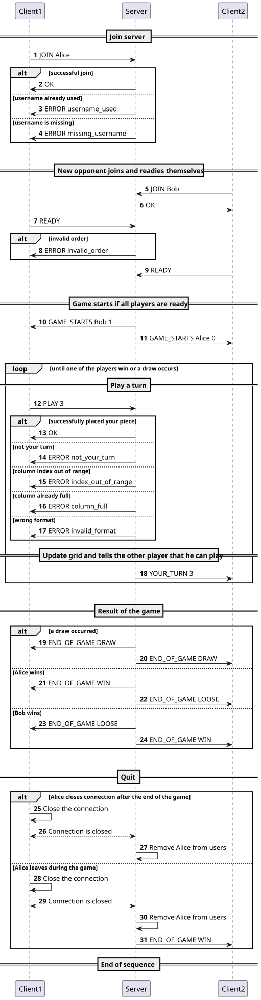
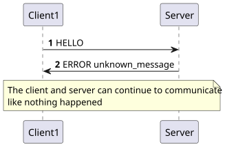
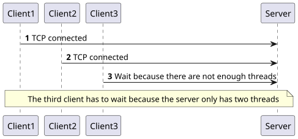
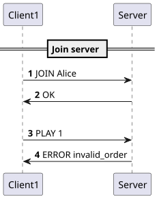
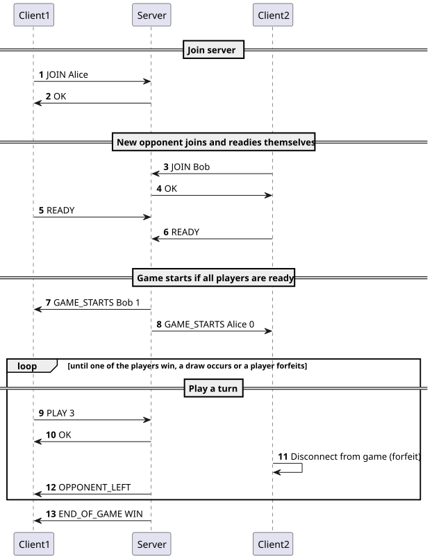
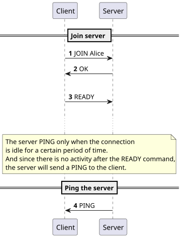

# Connect 4 - Simple application protocol

## Overview

The goal of this protocol is to allow clients to play connect 4 together with a server in the middle to host the game.

There's no specific protocol for connect 4 so we'll implement one.

## Transport protocol

This application protocol will be using TCP as a transport protocol as we need reliability for the commands that are sent by the clients.

The server will listen on TCP port 4444.

The messages sent and received by the server are treated as text encoded as UTF-8 and they are delimited by a `\n` new line character.

The initial connection must be established by the client. Once established, the client can choose a username and start a game. It must wait for another client to join the server to start a game.

A finished game doesn't disconnect the client. It offers to start a new game but once finished playing, the client is responsible for closing the connection with the server.

On an unknown command or mis-formated command, the server sends an error message to the client indicating the error type.

The server can hold up to `2 clients` at the same time. Other connections will be put on hold.

An order must be followed for the commands the client uses:

1. JOIN
2. READY
3. PLAY

The server also has an order to follow when sending data to the client:

1. GAME_STARTS (once the client is READY)
2. YOUR_TURN (after a client played)

If the order is not followed, the server will send an error.

## Commands

### Join the server

Once the TCP connection is established, the client can send a `JOIN` command to join the server:

**Request**

```
JOIN <username>
```
- `<username>` : the username of the client

**Response:**

- `OK`: The client has joined the server
- `ERROR <type>`: an error during the joining process
    - `username_used` : the username is already used
    - `missing_username`: the username is missing

### Tell the server the client is ready to play

Once the client joined the server and wants to start a game. It tells the server it is `READY`.

**Request**

```
READY
```

**Response**

- `ERROR <type>`
  - `invalid_order`: the order of command was broken

### The game starts

Once all clients are ready, the server sends `GAME_STARTS` to all the ready clients.

**Request**

```
GAME_STARTS <op_username> <your_turn>
```

- `<op_username>`: the username of the opponent
- `<your_turn>`: boolean defining if it's your turn. If true (1) it is your turn.

**Response**

No response needed from the clients.

### Play a turn

Once the game started, each player can, in turn, place a disc by sending the `PLAY` command.

**Request**

```
PLAY <column>
```

- `<column>`: the column number to place the disk

**Response**

- `ERROR <type>`
    - `not_your_turn`: This is not your turn
    - `invalid_input`: The input from the client is invalid (either column full or out of range)
    - `invalid_format`: Too few / too much argument or invalid format
    - `invalid_order`: the order of command was broken
- `OK` : the play was registered successfully

### It's your turn

Once a play was played by a player, the server sends the other player a `YOUR_TURN` announcement signaling the play that was made.

**Request**

```
YOUR_TURN <column>
```

- `<column>`: the column in which the opponent played

**Response**

None

### Opponent forfeited

If a player leaves during a game, the server sends the other player an `OPPONENT_LEFT` announcement signaling that the opponent has left the game and the server will send an `END_OF_GAME WIN` message right after.

```
OPPONENT_LEFT
```

**Response**

None

### End of a game

Once one player won or all the columns are full, the server sends a `END_OF_GAME` request to announce that the game is finished and who's the winner in case there's one or if it's a draw in announces the draw. Each client receives a different announcement (unless it's a draw) as one wins and the other looses.

**Request**

```
END_OF_GAME <code>
```

- `<code>`
    - `WIN`: the player has won the game
    - `LOOSE`: the player lost the game
    - `DRAW`: it's a draw

**Response**

None

### Quit the server

To quit the server, the client can simply closes the connections. As the protocol is TCP based, the server will notice the connection has been closed, remove the client from the list of connected clients and close the connection on its side too. The server should never close the connection by itself, the client is responsible for closing the connection.

### Unknown message

If the client sends an unknown message, the server will answer with a generic response.

**Response**

- `ERROR unknown_message`: tells the client that the request he made is unknown to him

### Ping message

To check if the client is still connected, the server can send a `PING` message to the client.

```
PING
```

**Response**

None

## Example - successful game (single PLAY turn)



### Example - unknown message



### Example - third client tries to connect to the server



### Example - client sends a command he's not supposed to



### Example - opponent leaves during the game



### Example - checking if the client is still connected

