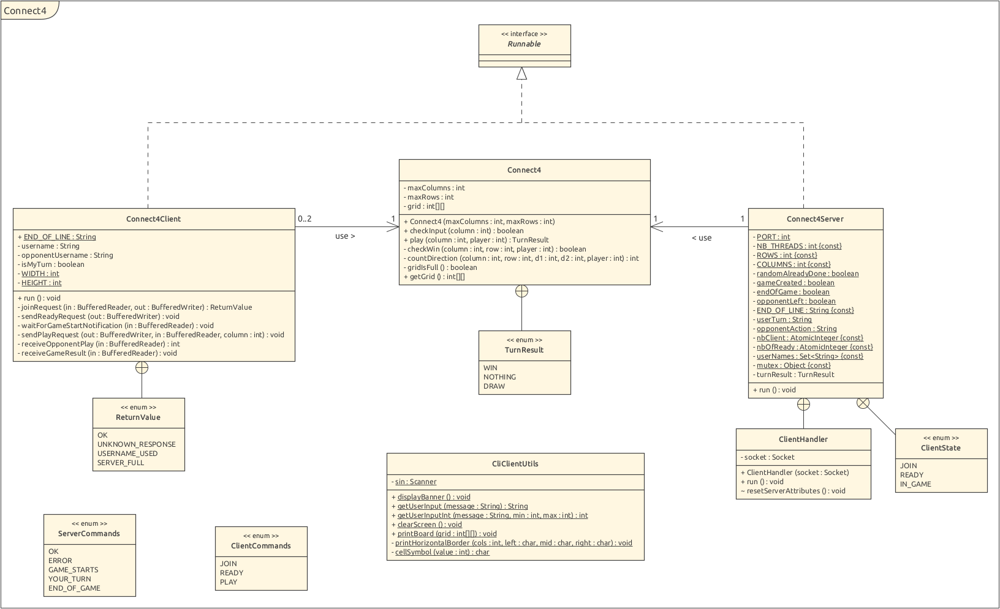
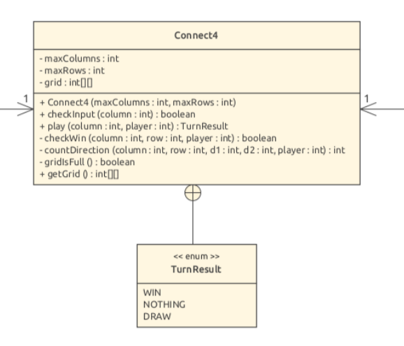
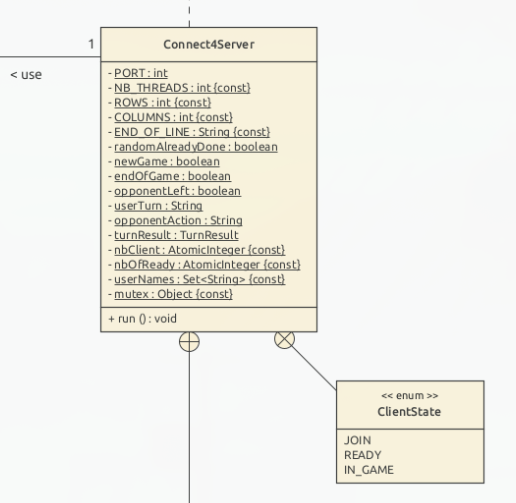
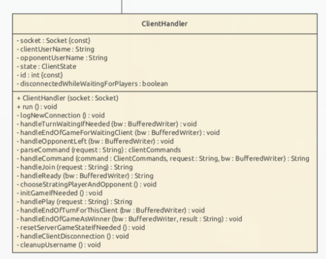
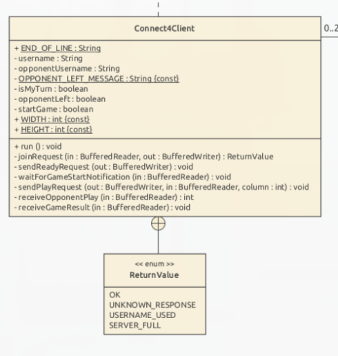
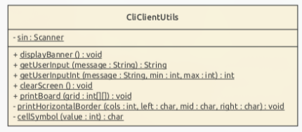

<!-- _class: lead -->
# **Connect 4**

---
# **Demo time !**

Launch the server:

```bash
docker run -it --rm --name c4-server --network connect4-net ghcr.io/tigid0u/connect4-docker:latest server
```

Launch the clients:

```bash
docker run -it --rm --network connect4-net ghcr.io/tigid0u/connect4-docker:latest client -o c4-server
```

---

# **Structure of the application**



---

# **Connect 4 library**



---
# **Connect 4 Server**

- **TODO**: list server commands
---

# **Connect 4 Server**

<div class="columns">
<div>



</div>
<div>



</div>
</div>

---
# **Connect 4 Client - Commands**

The client supports the following commands:

- **JOIN <username>**: Join the game with the specified username.
- **READY**: Indicate that the player is ready to start the game.
- **PLAY <column>**: Drop a disc into the specified column (0-6).

---

# **Connect 4 Client**
<div class="columns">
<div>



</div>
<div>



</div>
</div>

---
<!-- _class: lead -->
# **Any questions ?**
